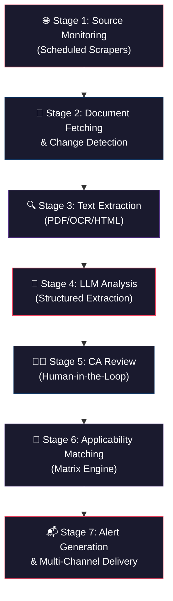
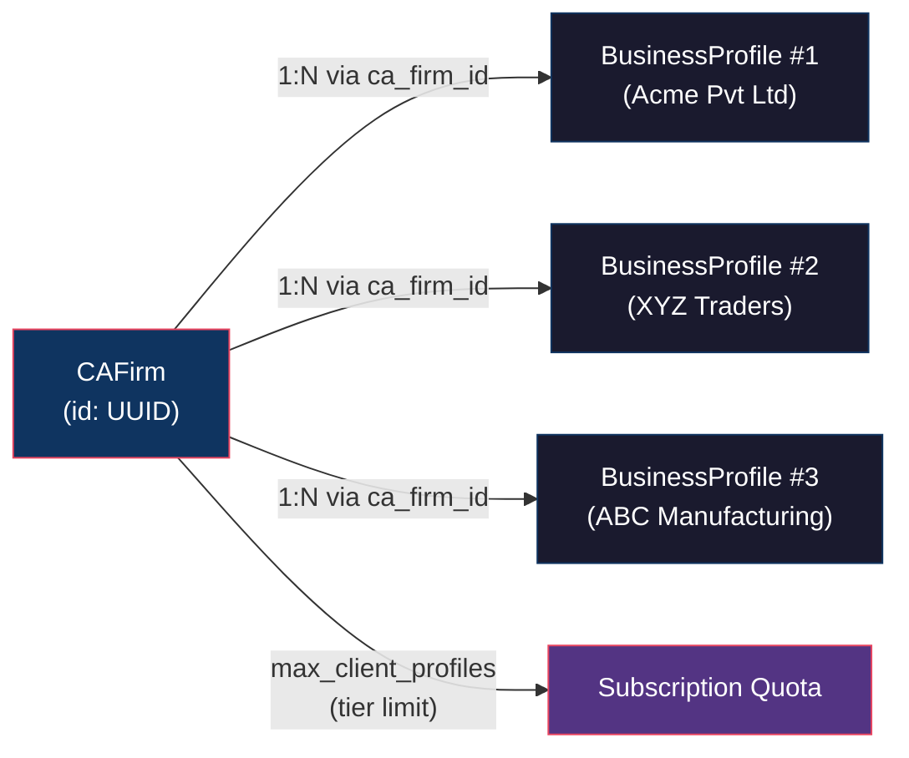
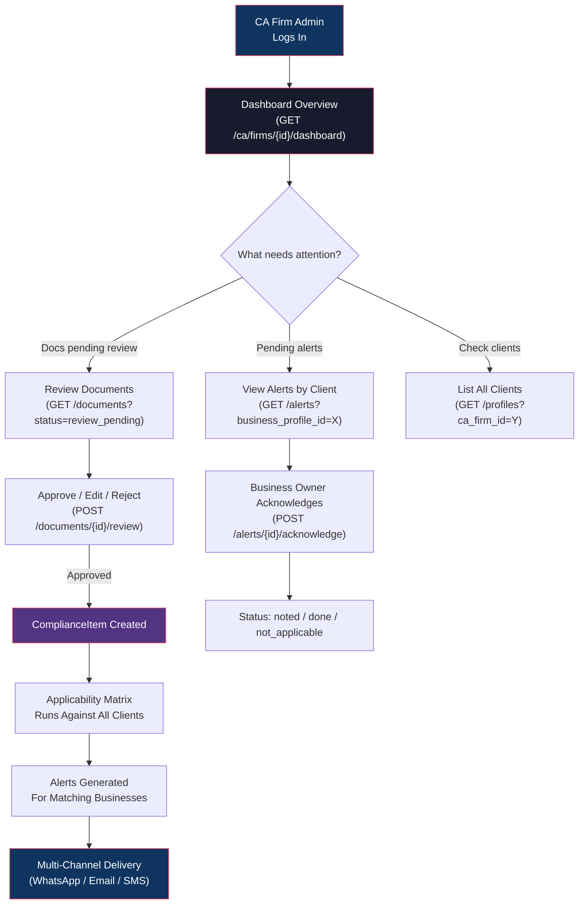

# RegRadar — Architecture Deep Dive

> [!NOTE]
> This document covers the ER diagram, applicability matrix, compliance flow, CA firm management, and regulatory alert monitoring for the RegRadar platform.

---

## 1. ER Diagram (Entity-Relationship)

```mermaid
erDiagram
    User {
        UUID id PK
        String email UK
        String hashed_password
        String full_name
        String phone
        Enum role "admin | ca_reviewer | ca_firm_admin | msme_owner"
        Boolean is_active
        Boolean is_verified
        UUID ca_firm_id FK
        DateTime created_at
        DateTime updated_at
    }

    CAFirm {
        UUID id PK
        String firm_name
        String registration_number
        String contact_email
        String contact_phone
        Text address
        String city
        Enum state
        Enum subscription_tier "ca_starter | ca_professional | ca_enterprise | msme_direct"
        Integer max_client_profiles
        Boolean is_active
        String custom_brand_name
        String custom_domain
        String logo_url
        DateTime created_at
        DateTime updated_at
    }

    BusinessProfile {
        UUID id PK
        String business_name
        Enum business_type
        Enum industry_sector
        String industry_sector_other
        String nic_code
        Enum registration_state
        JSONB operating_states
        Enum udyam_category
        Enum employee_count_band
        Enum annual_turnover_band
        Enum gst_status
        Boolean has_export_activity
        Boolean has_manufacturing_unit
        Boolean handles_food_products
        JSONB existing_licences
        UUID ca_firm_id FK
        Enum preferred_language
        JSONB alert_channels
        String whatsapp_number
        String email_address
        UUID owner_user_id FK
        Boolean is_active
        DateTime created_at
        DateTime updated_at
    }

    Source {
        UUID id PK
        String name UK
        String short_code UK
        String base_url
        JSONB secondary_urls
        String fetch_method "http_scraper | rss | api"
        Integer fetch_frequency_hours
        String scraper_module_name
        Boolean requires_pdf_extraction
        Boolean requires_ocr_fallback
        Boolean is_active
        DateTime last_fetched_at
        DateTime last_successful_fetch_at
        Text last_error
        Integer consecutive_failures
        DateTime created_at
        DateTime updated_at
    }

    Document {
        UUID id PK
        UUID source_id FK
        String url
        String title
        Text raw_text
        String content_hash
        String previous_hash
        String raw_pdf_s3_key
        String extraction_method
        Integer page_count
        Integer word_count
        Enum status "fetched | extracting | extracted | ... | approved"
        Text processing_error
        JSONB llm_extraction
        Float confidence_score
        UUID reviewer_id FK
        DateTime reviewed_at
        Text review_notes
        JSONB approved_extraction
        DateTime fetched_at
        DateTime first_seen_at
        DateTime last_changed_at
        DateTime processed_at
    }

    ComplianceItem {
        UUID id PK
        String compliance_id UK "e.g. GST-001"
        String title
        Text description
        Text summary_plain_english
        Text what_you_need_to_do
        String regulatory_body
        String regulation_reference
        String notification_number
        JSONB applicable_if
        JSONB not_applicable_if
        String frequency
        String due_date_logic
        JSONB alert_trigger_days_before
        Text penalty_for_non_compliance
        Enum urgency_level
        DateTime effective_date
        DateTime compliance_deadline
        UUID source_document_id FK
        Boolean is_amendment
        String amends_compliance_id
        Boolean is_verified
        UUID verified_by_id FK
        DateTime verified_at
        Boolean is_active
        DateTime created_at
        DateTime updated_at
    }

    Alert {
        UUID id PK
        UUID compliance_item_id FK
        UUID business_profile_id FK
        String alert_title
        Text alert_body
        Enum language
        Enum status "pending | sent | delivered | read | noted | done | not_applicable | failed"
        Text acknowledgement_note
        DateTime acknowledged_at
        DateTime created_at
        DateTime updated_at
    }

    DeliveryLog {
        UUID id PK
        UUID alert_id FK
        Enum channel "whatsapp | email | sms"
        String recipient
        DateTime sent_at
        DateTime delivered_at
        DateTime read_at
        DateTime failed_at
        Text error_message
        String external_message_id
        Integer retry_count
        DateTime created_at
    }

    ScraperRun {
        UUID id PK
        UUID source_id FK
        DateTime started_at
        DateTime finished_at
        Boolean success
        Integer documents_found
        Integer new_documents
        Integer changed_documents
        Text error_message
        Float duration_seconds
    }

    CAFirm ||--o{ User : "employs"
    CAFirm ||--o{ BusinessProfile : "manages"
    User ||--o{ BusinessProfile : "owns (owner_user_id)"
    Source ||--o{ Document : "produces"
    Document ||--o| ComplianceItem : "generates (1:1)"
    ComplianceItem ||--o{ Alert : "triggers"
    BusinessProfile ||--o{ Alert : "receives"
    Alert ||--o{ DeliveryLog : "tracked via"
    Source ||--o{ ScraperRun : "monitored by"
    User ||--o{ Document : "reviews (reviewer_id)"
    User ||--o{ ComplianceItem : "verifies (verified_by_id)"
```



### Key Relationships Summary

| From | To | Cardinality | FK Column | Purpose |
|---|---|---|---|---|
| [CAFirm](file:///c:/Users/divyp/Desktop/RegRadar/backend/app/models/models.py#55-85) → [User](file:///c:/Users/divyp/Desktop/RegRadar/backend/app/models/models.py#31-49) | 1:N | `users.ca_firm_id` | Users belong to a CA firm |
| [CAFirm](file:///c:/Users/divyp/Desktop/RegRadar/backend/app/models/models.py#55-85) → [BusinessProfile](file:///c:/Users/divyp/Desktop/RegRadar/backend/app/models/models.py#91-173) | 1:N | `business_profiles.ca_firm_id` | CA firm manages client businesses |
| [User](file:///c:/Users/divyp/Desktop/RegRadar/backend/app/models/models.py#31-49) → [BusinessProfile](file:///c:/Users/divyp/Desktop/RegRadar/backend/app/models/models.py#91-173) | 1:N | `business_profiles.owner_user_id` | MSME owner's profile |
| [Source](file:///c:/Users/divyp/Desktop/RegRadar/backend/app/models/models.py#179-205) → [Document](file:///c:/Users/divyp/Desktop/RegRadar/backend/app/models/models.py#211-260) | 1:N | `documents.source_id` | Regulatory source produces documents |
| [Document](file:///c:/Users/divyp/Desktop/RegRadar/backend/app/models/models.py#211-260) → [ComplianceItem](file:///c:/Users/divyp/Desktop/RegRadar/backend/app/models/models.py#266-328) | 1:1 | `compliance_items.source_document_id` | One document creates one compliance rule |
| [ComplianceItem](file:///c:/Users/divyp/Desktop/RegRadar/backend/app/models/models.py#266-328) → [Alert](file:///c:/Users/divyp/Desktop/RegRadar/backend/app/models/models.py#334-375) | 1:N | `alerts.compliance_item_id` | One rule can alert many businesses |
| [BusinessProfile](file:///c:/Users/divyp/Desktop/RegRadar/backend/app/models/models.py#91-173) → [Alert](file:///c:/Users/divyp/Desktop/RegRadar/backend/app/models/models.py#334-375) | 1:N | `alerts.business_profile_id` | Each business has its own alerts |
| [Alert](file:///c:/Users/divyp/Desktop/RegRadar/backend/app/models/models.py#334-375) → [DeliveryLog](file:///c:/Users/divyp/Desktop/RegRadar/backend/app/models/models.py#381-409) | 1:N | `delivery_logs.alert_id` | Multi-channel delivery tracking |
| [Source](file:///c:/Users/divyp/Desktop/RegRadar/backend/app/models/models.py#179-205) → [ScraperRun](file:///c:/Users/divyp/Desktop/RegRadar/backend/app/models/models.py#415-429) | 1:N | `scraper_runs.source_id` | Scraper health per source |

---

## 2. What is the Applicability Matrix?

The **Applicability Matrix** is the core intelligence engine of RegRadar. It is the system that determines **which regulatory compliance requirements apply to which businesses**.

### How It Works

Each [ComplianceItem](file:///c:/Users/divyp/Desktop/RegRadar/backend/app/models/models.py#266-328) stores two JSONB fields that form the matrix logic:

#### `applicable_if` — Positive-match rules
A JSON object defining the conditions under which this compliance item applies to a business. Example:

```json
{
  "gst_status": ["Registered (Regular)", "Registered (Composition Scheme)"],
  "annual_turnover_band": ["₹5Cr–₹10Cr", "₹10Cr–₹50Cr", "Above ₹50Cr"],
  "operating_states": ["Maharashtra", "Gujarat"]
}
```

**Interpretation**: This compliance item applies if the business has a matching GST status **AND** falls in one of the listed turnover bands **AND** operates in Maharashtra or Gujarat.

#### `not_applicable_if` — Exclusion rules
A JSON object defining conditions that explicitly **exclude** a business. Example:
```json
{
  "business_type": ["Trust/Society"],
  "udyam_category": ["Not Registered"]
}
```

**Interpretation**: Even if the positive rules match, the item does NOT apply to Trusts/Societies or businesses without Udyam registration.

### The 19 Business Profile Fields That Feed the Matrix

The matrix evaluates against these business attributes (all from the onboarding form):

| # | Field | Type | Example Match Rule |
|---|---|---|---|
| 1 | `business_name` | String | — (not typically matched) |
| 2 | `business_type` | Enum | `"Private Limited Company"` |
| 3 | `industry_sector` | Enum | `"Food & Beverage"` |
| 4 | `nic_code` | String | `"10612"` (Flour milling) |
| 5 | [registration_state](file:///c:/Users/divyp/Desktop/RegRadar/backend/app/schemas/schemas.py#113-121) | Enum | `"Karnataka"` |
| 6 | `operating_states` | JSONB Array | `["Maharashtra", "Tamil Nadu"]` |
| 7 | `udyam_category` | Enum | `"Micro"`, `"Small"` |
| 8 | `employee_count_band` | Enum | `"51-100"` |
| 9 | `annual_turnover_band` | Enum | `"₹1.5Cr–₹5Cr"` |
| 10 | `gst_status` | Enum | `"Registered (Regular)"` |
| 11 | `has_export_activity` | Boolean | `true` |
| 12 | `has_manufacturing_unit` | Boolean | `true` |
| 13 | `handles_food_products` | Boolean | `true` |
| 14 | `existing_licences` | JSONB Array | `["FSSAI", "IEC"]` |
| 15 | `ca_firm_id` | UUID | — (ownership linkage) |
| 16 | `preferred_language` | Enum | — (for alert delivery, not matching) |
| 17 | `alert_channels` | JSONB Array | — (for delivery, not matching) |
| 18 | `whatsapp_number` | String | — (for delivery) |
| 19 | `email_address` | String | — (for delivery) |

### Matching Algorithm (Conceptual)

```
for each ComplianceItem:
    for each BusinessProfile:
        match = TRUE

        for each key in applicable_if:
            if business[key] NOT IN applicable_if[key]:
                match = FALSE → skip

        if match AND not_applicable_if exists:
            for each key in not_applicable_if:
                if business[key] IN not_applicable_if[key]:
                    match = FALSE → skip

        if match:
            → Generate Alert for this business + compliance item
```

### Concrete Example

> **ComplianceItem**: `GST-001` — "Monthly GSTR-3B Filing"
> - `applicable_if`: `{"gst_status": ["Registered (Regular)"], "annual_turnover_band": ["₹5Cr–₹10Cr", "Above ₹50Cr"]}`
> - `not_applicable_if`: `{"business_type": ["Trust/Society"]}`
>
> **BusinessProfile**: "Acme Pvt Ltd" — Private Limited, GST Regular, Turnover ₹7Cr
> - ✅ Match! → Alert generated

> **BusinessProfile**: "XYZ Trust" — Trust/Society, GST Regular, Turnover ₹8Cr
> - ❌ Excluded by `not_applicable_if` → No alert

---

## 3. Complete Compliance Flow — End to End

The RegRadar compliance pipeline has **7 distinct stages**:



### Stage 1 — Source Monitoring (Scheduled Scrapers)

**What happens**: The system periodically polls Indian regulatory websites for changes.

**Components involved**:
- [Source](file:///c:/Users/divyp/Desktop/RegRadar/backend/app/models/models.py#L179-L205) model — defines which sites to monitor
- [BaseScraper](file:///c:/Users/divyp/Desktop/RegRadar/backend/app/scrapers/base.py#L49-L137) — abstract base class with retry/anti-blocking logic
- [ScraperRun](file:///c:/Users/divyp/Desktop/RegRadar/backend/app/models/models.py#L415-L429) — logs each scraping attempt

**Details**:
| Feature | Implementation |
|---|---|
| Fetch methods | `http_scraper`, `rss`, `api` |
| Frequency | Configurable per source (default: 24 hours) |
| Anti-blocking | 10 rotating User-Agents, random 5–15s delays, Indian locale headers |
| Retry logic | 3 attempts with exponential backoff (2x, min 4s, max 30s) |
| Health tracking | `consecutive_failures`, `last_error`, `last_successful_fetch_at` |

### Stage 2 — Document Fetching & Change Detection

**What happens**: Scrapers download regulatory documents and detect whether content has changed.

**Components involved**:
- [Document](file:///c:/Users/divyp/Desktop/RegRadar/backend/app/models/models.py#L211-L259) model — stores fetched content
- [RawDocument](file:///c:/Users/divyp/Desktop/RegRadar/backend/app/scrapers/base.py#L37-L46) dataclass — intermediate scraper output

**Change detection mechanism**:
```
1. Scraper fetches page content
2. Text is normalized (lowercase, strip whitespace, remove page artifacts)
3. SHA-256 hash is computed → stored as `content_hash`
4. If content_hash != previous_hash → content has CHANGED → proceed
5. If content_hash == previous_hash → no change → skip
```

**Storage**: Raw PDFs can be uploaded to S3 (`raw_pdf_s3_key`), raw text is stored in `raw_text`.

### Stage 3 — Text Extraction (PDF/OCR/HTML)

**What happens**: Raw content is converted into clean text for analysis.

**Methods** (stored in `extraction_method`):
| Method | When Used |
|---|---|
| `html` | When source delivers HTML content |
| `pdfplumber` | Primary PDF text extraction |
| `pymupdf` | Fallback PDF extraction |
| `ocr` | When PDF is scanned/image-based (`requires_ocr_fallback = true`) |

**Output**: Updates `Document.raw_text`, `page_count`, `word_count`, and sets `status = 'extracted'`.

### Stage 4 — LLM Analysis (Structured Extraction)

**What happens**: An LLM (e.g., GPT-4/Gemini) reads the raw text and produces a structured JSON extraction.

**Input**: `Document.raw_text`
**Output**: `Document.llm_extraction` (JSONB) + `Document.confidence_score`

The [LLMExtractionResult](file:///c:/Users/divyp/Desktop/RegRadar/backend/app/schemas/schemas.py#L231-L244) schema defines the expected structure:

```json
{
  "title": "Notification No. 14/2025-Central Tax",
  "summary_plain_english": "GST late filing fee reduced for small taxpayers...",
  "what_you_need_to_do": "File your pending GSTR-3B returns before March 31...",
  "affected_business_types": ["Private Limited Company", "LLP"],
  "effective_date": "2025-04-01",
  "compliance_deadline": "2025-06-30",
  "penalty_for_non_compliance": "₹50/day up to ₹10,000",
  "regulatory_body": "CBIC",
  "notification_number": "14/2025-CT",
  "urgency_level": "High",
  "is_amendment_to_existing_rule": true,
  "confidence_score": 0.92
}
```

**Status transition**: `extracted` → `processing` → `processed` → `review_pending`

### Stage 5 — CA Review (Human-in-the-Loop)

**What happens**: A CA (Chartered Accountant) reviewer validates the LLM extraction before it becomes a compliance item.

**API Endpoint**: `POST /api/v1/documents/{doc_id}/review` ([documents.py:L65-101](file:///c:/Users/divyp/Desktop/RegRadar/backend/app/api/routes/documents.py#L65-L101))

**Three possible actions**:

| Action | Result | Status |
|---|---|---|
| `approve` | LLM extraction accepted as-is → `approved_extraction = llm_extraction` | `approved` |
| `edit` | CA modifies extraction → `approved_extraction = edited_extraction` | `approved` |
| `reject` | Document discarded (not relevant/incorrect) | `rejected` |

**Guard rail**: Only documents in `review_pending` status can be reviewed (enforced at [documents.py:L77-81](file:///c:/Users/divyp/Desktop/RegRadar/backend/app/api/routes/documents.py#L77-L81)).

### Stage 6 — Applicability Matching (Matrix Engine)

**What happens**: The approved extraction is converted into a [ComplianceItem](file:///c:/Users/divyp/Desktop/RegRadar/backend/app/models/models.py#266-328) and matched against all [BusinessProfile](file:///c:/Users/divyp/Desktop/RegRadar/backend/app/models/models.py#91-173) records using the applicability matrix.

**Flow**:
```
1. Approved Document → Create/Update ComplianceItem
2. Set applicable_if / not_applicable_if rules (from LLM + CA edits)
3. For each active BusinessProfile:
   a. Evaluate applicable_if conditions against profile fields
   b. Check not_applicable_if exclusions
   c. If match → create Alert
```

**API**: `POST /api/v1/compliance/` ([compliance.py:L21-42](file:///c:/Users/divyp/Desktop/RegRadar/backend/app/api/routes/compliance.py#L21-L42))

### Stage 7 — Alert Generation & Multi-Channel Delivery

**What happens**: Personalized alerts are created for each matching business and delivered via their preferred channels.

**Alert creation**:
- Links a [ComplianceItem](file:///c:/Users/divyp/Desktop/RegRadar/backend/app/models/models.py#266-328) to a [BusinessProfile](file:///c:/Users/divyp/Desktop/RegRadar/backend/app/models/models.py#91-173)
- `alert_title` and `alert_body` are generated (potentially in the user's `preferred_language`)
- Enforced uniqueness: one alert per compliance-item + business combination ([UniqueConstraint](file:///c:/Users/divyp/Desktop/RegRadar/backend/app/models/models.py#L370-L373))

**Delivery channels** (tracked via [DeliveryLog](file:///c:/Users/divyp/Desktop/RegRadar/backend/app/models/models.py#L381-L408)):
| Channel | Recipient Field | External Provider |
|---|---|---|
| WhatsApp | `whatsapp_number` | BSP (Business Service Provider) |
| Email | `email_address` | SendGrid |
| SMS | `phone` | SMS gateway |

**Alert lifecycle**:
```
pending → sent → delivered → read → acknowledged (noted/done/not_applicable)
                                   ↘ failed (with error_message)
```

**Acknowledgement API**: `POST /api/v1/alerts/{alert_id}/acknowledge` ([alerts.py:L65-93](file:///c:/Users/divyp/Desktop/RegRadar/backend/app/api/routes/alerts.py#L65-L93))

---

## 4. CA Firm → Business Management & Alert Monitoring

### How Does a CA Firm Know What Businesses It Manages?

The relationship is modeled through the `ca_firm_id` foreign key on [BusinessProfile](file:///c:/Users/divyp/Desktop/RegRadar/backend/app/models/models.py#91-173):



#### Query: Get all businesses managed by a CA firm

**API Endpoint**: `GET /api/v1/profiles/?ca_firm_id={firm_id}` ([business_profiles.py:L54-84](file:///c:/Users/divyp/Desktop/RegRadar/backend/app/api/routes/business_profiles.py#L54-L84))

```python
# Internal query (from business_profiles.py)
query = select(BusinessProfile).where(
    BusinessProfile.ca_firm_id == ca_firm_id,
    BusinessProfile.is_active == True,
)
```

#### Subscription tiers control the capacity

| Tier | `max_client_profiles` | Target |
|---|---|---|
| `ca_starter` | 25 | Small CA firms |
| `ca_professional` | (configurable) | Mid-size firms |
| `ca_enterprise` | (configurable) | Large firms |
| `msme_direct` | 1 (self) | Direct MSME users |

#### Users also belong to CA firms

```python
# User.ca_firm_id links employees to their firm
class User(Base):
    ca_firm_id = Column(UUID, ForeignKey("ca_firms.id"), nullable=True)
    role = Column(Enum(UserRole))  # ca_firm_admin, ca_reviewer, etc.
```

### How Does a CA Firm Monitor Regulatory Alerts for Its Clients?

#### The CA Dashboard

**API**: `GET /api/v1/ca/firms/{firm_id}/dashboard` ([ca_dashboard.py:L41-109](file:///c:/Users/divyp/Desktop/RegRadar/backend/app/api/routes/ca_dashboard.py#L41-L109))

Returns a real-time summary:

```json
{
  "firm_name": "Sharma & Associates",
  "subscription_tier": "ca_professional",
  "max_client_profiles": 100,
  "active_clients": 47,
  "pending_alerts": 12,
  "acknowledged_alerts": 235,
  "documents_pending_review": 3
}
```

#### How the dashboard computes metrics

| Metric | Query Logic |
|---|---|
| **Active Clients** | `COUNT(BusinessProfile) WHERE ca_firm_id = firm AND is_active = TRUE` |
| **Pending Alerts** | `COUNT(Alert) JOIN BusinessProfile WHERE ca_firm_id = firm AND alert.status = 'pending'` |
| **Acknowledged Alerts** | `COUNT(Alert) WHERE status IN ('noted', 'done', 'not_applicable')` |
| **Docs Pending Review** | `COUNT(Document) WHERE status = 'review_pending'` (global, for CA reviewers) |

#### Monitoring Flow for a CA Firm



#### Complete Monitoring Cycle

1. **CA Firm Admin** opens the dashboard → sees pending docs + alert counts
2. **CA Reviewer** reviews LLM-processed documents → approves/edits/rejects
3. **Approved docs** become `ComplianceItems` with applicability rules
4. **Applicability engine** matches items against all `BusinessProfiles` under the firm
5. **Alerts** are auto-generated for matching businesses
6. Alerts are **delivered** via WhatsApp, Email, SMS based on each business's preferences
7. **MSME owners** receive alerts and **acknowledge** them (noted/done/not applicable)
8. CA firm dashboard shows **real-time status** of all client alerts

> [!IMPORTANT]
> The CA firm can see alerts for **all** its managed businesses through the `ca_firm_id` linkage. The [Alert](file:///c:/Users/divyp/Desktop/RegRadar/backend/app/models/models.py#334-375) table joins to [BusinessProfile](file:///c:/Users/divyp/Desktop/RegRadar/backend/app/models/models.py#91-173), which joins to [CAFirm](file:///c:/Users/divyp/Desktop/RegRadar/backend/app/models/models.py#55-85), giving the firm complete visibility across its entire client portfolio.
